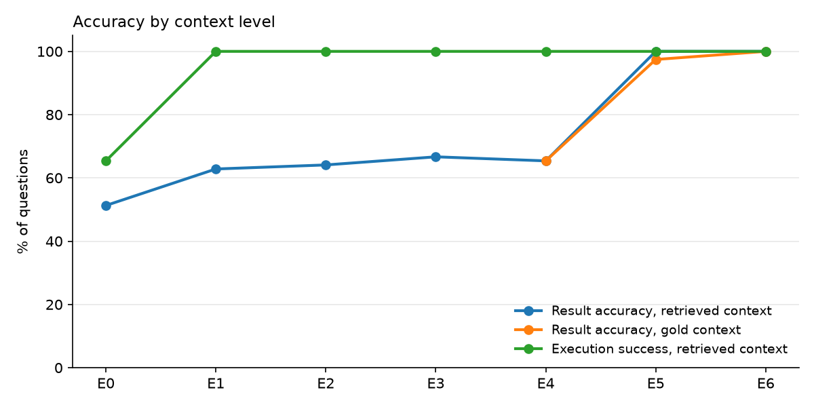
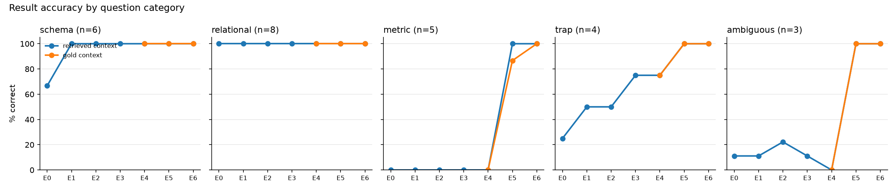

# Pilot review: 26 questions × E0–E6 (+ gold context E4–E6) × 3 repeats

**Run `20261005T145111Z` settings:**
- model `openai.gpt-6-sol`, at its default temperature (it rejects temperature 0, so outputs vary between runs)
- prompt `generation/v1`
- local embeddings `BAAI/bge-small-en-v1.5`, top-3 per knowledge type
- benchmark `pilot-2`
- 780 LLM calls in 644 s

Charts are in [`figures/pilot/`](figures/pilot/). The full machine-generated report is written to
`experiments/results/ladder/<run_id>/report.md` (git-ignored).

> **Read this as a pilot, not as results.** There are 26 questions (3–8 per category), and the same author wrote the
> benchmark *and* the semantic layer. The pilot set is also a development set: the semantic layer and benchmark were
> fixed using earlier pilot runs (see "Setup issues found and fixed").

---

## 1. Architecture (what ran)

```
question ─► context builder ──► prompt template (one file, same for every level) ─► LLM ─► extract SQL
               │  E1–E3: schema rendered from the PostgreSQL catalog (+ keys, + descriptions)
               │  E4–E6: embed question (local bge-small) → pgvector cosine top-3 per type
               │         (entities; + metrics; + domain rules)    "-gold": the question's required items instead
               ▼
          validate (sqlglot) ─► execute as read-only role ─► compare result with ground truth ─► label failure
```

Only the context block changes between levels. The instructions, output format and model are identical.

## 2. Benchmark questions

| id | category | question | tags |
|---|---|---|---|
| p01 | schema | How many orders are in the dataset? | STRUCTURAL |
| p02 | schema | How many sellers are there in each state? | STRUCTURAL |
| p03 | schema | How many orders were canceled? *(anti-trap)* | STRUCTURAL, DESCRIPTIVE |
| p04 | schema | Average number of installments for credit card payments? | STRUCTURAL, DESCRIPTIVE |
| p25 | schema | Which month in 2017 had the largest increase in orders vs the previous month? | STRUCTURAL, TEMPORAL |
| p26 | schema | What percentage of reviews include a written comment message? | STRUCTURAL, DESCRIPTIVE |
| p05 | relational | How many order items belong to sellers located in SP? | RELATIONAL |
| p06 | relational | Average freight per order item, by customer state? | RELATIONAL, MULTI_HOP |
| p07 | relational | Average review score given by customers in RJ? | RELATIONAL, MULTI_HOP |
| p08 | relational | Which 10 sellers have received the most distinct orders? | RELATIONAL |
| p21 | relational | How many sellers have a zip prefix with no geolocation row? | RELATIONAL |
| p22 | relational | How many orders contain items from more than one seller? | RELATIONAL |
| p23 | relational | Per seller state, distinct orders with an item sold to a customer in another state? | RELATIONAL, MULTI_HOP |
| p24 | relational | Which 5 customer states have the highest average number of items per order? | RELATIONAL, MULTI_HOP |
| p09 | metric | What was the total revenue in 2017? | METRIC, DOMAIN, TEMPORAL, TRAP |
| p10 | metric | What is the average order value? | METRIC |
| p11 | metric | What is the repeat customer rate? | METRIC, IDENTITY, TRAP |
| p12 | metric | % of delivered orders that arrived after the estimated date? | METRIC, TEMPORAL |
| p13 | metric | New customers acquired in each month of 2018? | METRIC, IDENTITY, TEMPORAL |
| p14 | trap | How many customers are there? | IDENTITY, TRAP |
| p15 | trap | Top 5 categories (English) by average review score, ≥500 reviewed orders | DOMAIN, TRAP, MULTI_HOP |
| p16 | trap | Revenue from orders paid at least partly by voucher? | DOMAIN, METRIC, TRAP |
| p17 | trap | Total payment value of delivered orders purchased in 2018? *(anti-trap)* | DOMAIN, TEMPORAL, TRAP |
| p18 | ambiguous | Who are our best customers? | AMBIGUITY, IDENTITY, METRIC |
| p19 | ambiguous | Which sellers are doing well? | AMBIGUITY, METRIC |
| p20 | ambiguous | Show me customer adoption. | AMBIGUITY, IDENTITY, TEMPORAL, METRIC |

Each question lists the **minimal** knowledge items it needs (`required_knowledge`, used as gold context and for
recall) and other relevant but redundant items (`related_knowledge`, counted as relevant for precision).

## 3. Example prompts (from the traces, question p14 "How many customers are there?")

**E0: the full prompt.** Every level uses this exact text, with a context block inserted before `Question:`.

```text
You are an expert data analyst. Write one PostgreSQL query that answers the question.

Rules:
- Return exactly one read-only query (SELECT, or WITH ... SELECT).
- Return only the SQL inside a ```sql code block, with no explanation.
- If the question is ambiguous, choose the most reasonable interpretation.

Question: How many customers are there?
```

**E1: names and types** (the `customers` table shown; all 9 tables are included):
```text
TABLE customers
  customer_id char(32)
  customer_unique_id char(32)
  customer_zip_code_prefix char(5)
  customer_city text
  customer_state char(2)
```

**E2: + keys and relationships:**
```text
TABLE customers
  customer_id char(32) PK
  customer_unique_id char(32)
  ...
RELATIONSHIPS (from -> to, cardinality):
  orders.customer_id -> customers.customer_id (one-to-one)
  order_items.order_id -> orders.order_id (many-to-one)
  ...
  sellers.seller_zip_code_prefix -> geolocation.geolocation_zip_code_prefix (many-to-one)  -- No foreign key; ... (use LEFT JOIN).
```

**E3: + descriptions:**
```text
TABLE customers  -- Customer record attached to each order, with the delivery location.
  customer_id char(32) PK  -- Key to the orders table. Each order has its own customer_id.
  customer_unique_id char(32)  -- Anonymised identifier of the customer.
  ...
```

**E4 / E5 / E6: retrieved knowledge appended after the E3 schema** (top-3 per type; E6 shown):
```text
BUSINESS DEFINITIONS:                                 (E4+)
- Customer: A customer is a unique person ... Identify customers with customers.customer_unique_id ...
- Customer location: ...
- Order: ...

METRIC DEFINITIONS:                                   (E5+)
- Number of customers: Number of customers = COUNT(DISTINCT customers.customer_unique_id) ...
- Repeat customer rate: ...
- Best / top / most valuable customers: ...

DOMAIN RULES AND KNOWN PITFALLS:                      (E6)
- Pitfall: customer_id is per order: COUNT(DISTINCT customers.customer_id) or COUNT(*) FROM customers returns
  the number of orders (99,441), not the number of people. ...
- Data coverage and sparse months: ...
- Pitfall: payment_value is not revenue: ...
```

Average prompt size: E0 84 tokens → E1 515 → E2 770 → E3 1,426 → E4 1,605 → E5 1,776 → E6 1,986.

## 4. Retrieval examples (E6, top-3 per type)

**Bold** = required, *italic* = related, plain = not relevant.

| question | entities | metrics | domain rules | recall | precision |
|---|---|---|---|---:|---:|
| p14 How many customers are there? | **customer** .72, customer_location .61, order .57 | *number_of_customers* .70, repeat_customer_rate .69, best_customers .64 | *customer_id_is_per_order* .73, data_coverage .57, payment_value_vs_revenue .53 | 1.0 | 0.33 |
| p09 Total revenue in 2017? | order .45, review .45, customer .45 | **revenue** .64, seller_performance .60, customer_spend .57 | *payment_value_vs_revenue* .61, data_coverage .60, delivery_metrics_delivered_only .48 | 1.0 | 0.22 |
| p10 Average order value? | order .71, order_item .68, review .65 | **average_order_value** .82, average_review_score .74, number_of_orders .72 | payment_item_fanout .68, payment_value_vs_revenue .67, review_item_fanout .65 | 1.0 | 0.11 |
| p13 New customers each month of 2018? | *customer* .63, order .55, customer_location .51 | **new_customers** .76, repeat_customer_rate .63, customer_spend .61 | **data_coverage** .68, *customer_id_is_per_order* .67, *time_attribution* .55 | 1.0 | 0.56 |
| p20 Show me customer adoption. | *customer* .68, customer_location .60, review .57 | **new_customers** .73, best_customers .63, repeat_customer_rate .63 | *customer_id_is_per_order* .64, canceled_orders .58, time_attribution .57 | 1.0 | 0.33 |

What this shows about retrieval:
- **The directly named concept is always retrieved at rank 1**, even without word overlap ("adoption" → `new_customers`, 0.73).
- **Recall is 1.0 at every level.** Once each metric definition is self-contained, a question needs only 1–2 items and top-3 per type always finds them. For this benchmark, **retrieval is not the bottleneck.**
- **Precision is low by construction** (0.11–0.56). Nine items are retrieved; one to five are relevant.
- **Similarities are bunched together.** The 2nd and 3rd items are often within 0.05 of each other, so a similarity cut-off would be fragile.

## 5. Results

| Level | Result accuracy | Range across repeats | Unstable questions | Execution | Avg input tokens | Avg output tokens* | Avg latency |
|---|---:|---:|---:|---:|---:|---:|---:|
| E0 | 51% | 50–54% | 1 | 65% | 84 | 190 | 4.1 s |
| E1 | 63% | 62–65% | 1 | 100% | 515 | 157 | 3.5 s |
| E2 | 64% | 62–69% | 2 | 100% | 770 | 162 | 3.4 s |
| E3 | 67% | 65–69% | 1 | 100% | 1,426 | 160 | 3.5 s |
| E4 | 65% | 65–65% | 0 | 100% | 1,605 | 160 | 3.5 s |
| E5 | 100% | 100–100% | 0 | 100% | 1,776 | 116 | 2.9 s |
| E6 | 100% | 100–100% | 0 | 100% | 1,986 | 115 | 2.8 s |
| E4-gold | 65% | 65–65% | 0 | 100% | 1,431 | 167 | 3.6 s |
| E5-gold | 97% | 96–100% | 1 | 100% | 1,458 | 120 | 2.9 s |
| E6-gold | 100% | 100–100% | 0 | 100% | 1,465 | 113 | 2.8 s |

\* Output tokens include hidden reasoning. Average reasoning tokens per call: E0 108, E1 57, E3 56, E5 30, E6 31.

**Accuracy by category** (mean over 3 repeats):

| Level | schema (6) | relational (8) | metric (5) | trap (4) | ambiguous (3) |
|---|---:|---:|---:|---:|---:|
| E0 | 67% | 100% | 0% | 25% | 11% |
| E1 | 100% | 100% | 0% | 50% | 11% |
| E2 | 100% | 100% | 0% | 50% | 22% |
| E3 | 100% | 100% | 0% | 75% | 11% |
| E4 | 100% | 100% | 0% | 75% | 0% |
| E5 | 100% | 100% | 100% | 100% | 100% |
| E6 | 100% | 100% | 100% | 100% | 100% |
| E5-gold | 100% | 100% | 87% | 100% | 100% |
| E6-gold | 100% | 100% | 100% | 100% | 100% |

**Questions fixed and broken between levels** (majority of 3 repeats):

| Transition | Fixed | Broken |
|---|---|---|
| E0 → E1 | p03, p15, p25 | – |
| E1 → E2 | – | – |
| E2 → E3 | p14 | – |
| E3 → E4 | – | – |
| E4 → E5 | p09, p10, p11, p12, p13, p16, p18, p19, p20 | – |
| E5 → E6 | – | – |




### What the pilot suggests (directional only)

1. **Structure is not the bottleneck for this model.** Schema questions reach 100% from E1. Relational questions are 100% *even at E0*, including the harder ones added for this run (soft join, multi-seller orders, two join paths). The model already knows Olist's table and column names (F1).
2. **The jump comes entirely from metric definitions.** E4 → E5 fixes 9 questions and breaks none. Every metric question scores 0% at E0–E4, at every repeat, and 100% at E5.
3. **Entity definitions (E4) added nothing.** The one identity question they target (p14) was already fixed at E3 by a description line (F2). Identity knowledge alone wasn't enough for metric questions either (F4).
4. **Domain rules (E6) added nothing once metrics were self-contained.** In an earlier pilot run, E6 added 15 points. Almost all of that came from metric definitions that referred to an undefined term ("eligible orders"), which the E6 rules happened to define. *Where* a fact lives matters more than which "type" it is.
5. **Retrieval is not the bottleneck here.** Recall is 1.0 at every level, and retrieved context is as good as gold (E6 and E6-gold are both 100%). Gold is even slightly worse at E5 (p13, F5), because the extra "redundant" items sometimes help.
6. **More relevant context made the model faster and terser.** Input grows 24× from E0 to E6, while output tokens drop 40%, reasoning tokens drop 70% and latency drops about a third.
7. **No sign of context hurting.** No question got worse at any step up the ladder. The anti-trap questions (p03 "canceled", p17 "payment value") were never over-ruled by the "exclude canceled" or "revenue ≠ payments" rules.
8. **The E5 ceiling is the most important caveat.** 100% at E5 in all three repeats most likely means the semantic layer encodes the benchmark's answers, because one author wrote both with the same questions in mind. That shows the model *follows* definitions faithfully. It does **not** show that business context helps on questions the semantic layer wasn't written for. A held-out benchmark, written independently of the semantic layer, is needed before drawing that conclusion.

## 6. Interesting failures

**F1. The model already knows Olist (E0: 51% with no schema at all).** Its E0 answer to p05 was
`SELECT COUNT(*) FROM order_items AS oi JOIN sellers AS s ON oi.seller_id = s.seller_id WHERE s.seller_state = 'SP'`,
with every table and column name right. All 8 relational questions are correct at E0, but p03 uses `status` instead of
`order_status` (0/3). This is the pretraining-contamination confounder: E0 measures memory of a public dataset.

**F2. The identity trap is fixed by one description line (p14 "How many customers are there?").** At E0–E2 the model
wrote `SELECT COUNT(*) FROM customers`, giving 99,441 (that's the number of orders). At E3 it wrote
`COUNT(DISTINCT customer_unique_id)`, giving 96,096 (people), in 3/3 repeats. The only new information was
"Each order has its own customer_id" and "Anonymised identifier of the customer". A good data dictionary carried
the business-identity knowledge.

**F3. Revenue and AOV computed from payments (p09, p10 at E0–E4).** p09: `SUM(p.payment_value) FROM orders JOIN order_payments`
gives 7.25M instead of 6.11M (it includes freight and installment interest, and doesn't exclude canceled orders). p10: per-order
`SUM(payment_value)` gives an AOV of 160.99 instead of 137.42. Both are reasonable SQL with the wrong definition, and both
were fixed as soon as the metric definition appeared (E5). Labelled METRIC_DEFINITION, correctly.

**F4. Knowing *who* the customer is doesn't tell you *which orders count* (p11 at E4).** With the customer entity
retrieved, the model correctly grouped by `customer_unique_id` but counted every status: 3.12% instead of 3.04%.
Fixed at E5 by the metric definition, which includes the status filter. Labelled WRONG_FILTER, correctly.

**F5. The minimal gold context is not always enough (p13 at E5-gold, 1/3).** Given only the new-customer metric, the model
twice generated a full calendar (`generate_series` to December 2018), returning 12 rows with zeros for Sep–Dec instead of
the 8 months that have data. Retrieved E5 context (6 items, none of them the data-coverage rule) got it right 3/3, and E6-gold
(which includes `rule.data_coverage`) got it right 3/3. The zero-filled answer is defensible. The organisation's rule decides
it, and without the rule the model's choice is close to a coin flip.

**F6. A sensible analyst answer that doesn't match the definition (p18 "Who are our best customers?" at E4).** The model returned
5 columns, with spend computed from `payment_value` over delivered orders only. It's a reasonable reading, but it doesn't match the
organisation's definition or either documented alternative. With the definition (E5), it scored 3/3. Ambiguous questions go
from 0–22% to 100% at E5. **Caveat:** "correct" means "matches *our* definition", which is the author-bias confounder.

**F7. Without a definition, the same prompt gives different interpretations (p20 "Show me customer adoption." at E3, 1/3).**
One repeat returned new customers per month (plus a running total), matching the definition. The other two returned new,
returning and active customers with a running total, over 24 months instead of 23, which doesn't match. That's three repeats of one prompt
and two different readings of "adoption". At E1, E2 and E4 the model mostly matched a documented alternative (new customers counting every
order status), so the "plausible" score is higher than strict accuracy there. With the definition (E5), all repeats agree.

### Failure-label quality

The rule-based labels are good for triage: F3, F4 and F5 got sensible labels. They can still mislead. For example, F6 was labelled
WRONG_TABLE ("missing order_items") when the real issue is the definition. Manual labels
(`manual_labels.yaml` in the run directory) are needed for the article's failure analysis.

## Setup issues found and fixed during the pilot

Earlier pilot runs (20 questions, 1 repeat) surfaced problems in our own setup. All of them are now fixed and covered by tests.

| Issue | Fix |
|---|---|
| Ordered comparison failed when rounding made two values tie and swap places (a false "context hurt" signal) | Rows tied within tolerance may appear in any order (`evaluation/compare_results.py`) |
| Five metric definitions said "eligible orders" without defining it, so a metric retrieved alone was incomplete | Every metric spells out its status filter; a test enforces self-contained metrics |
| The pgvector store could drift from `semantic/*.yaml` after edits | The runner refuses to start if any item's content hash differs; re-index first |
| Schema and relational categories were saturated | Added 6 harder questions (p21–p26). They are still saturated (see finding 1) |
| The model rejects temperature 0 | 3 repeats per condition; the report shows range across repeats and unstable questions |
| p23 originally said "shipped", which reasonably implies a carrier-date filter | Reworded to "sold … to a customer located in a different state" |
| p13's gold context missed the data-coverage rule that decides its answer | Added `rule.data_coverage` to p13's required knowledge |
| `required_knowledge` mixed essential and redundant items, so recall penalised correct answers | Split into minimal `required_knowledge` and `related_knowledge` |

## What to do next

1. **A held-out benchmark written independently of the semantic layer** (ideally by someone who hasn't read it). Without
   this, E5's 100% can't be told apart from "the definitions contain the answers".
2. **Experiment C (misleading context).** The model follows definitions faithfully (F3, F6), so test whether it follows *wrong* ones.
3. **A second model**, preferably one that doesn't know Olist as well, to check whether the ladder's shape depends on the model's prior knowledge.
4. **Experiment D (context quantity)** is less urgent: recall is already 1.0 at top-3.
